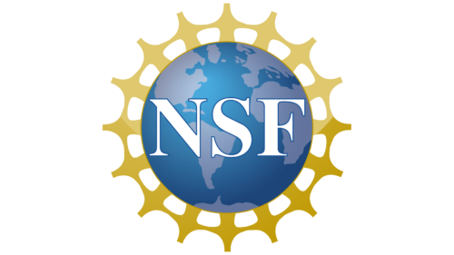
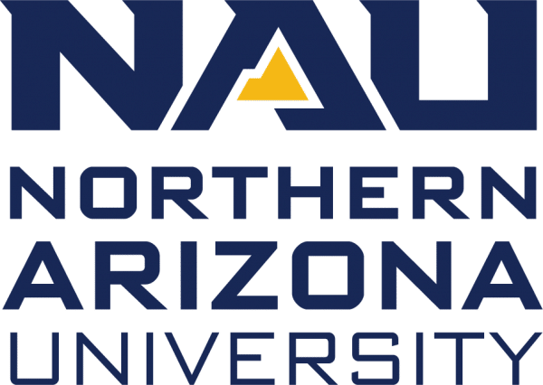
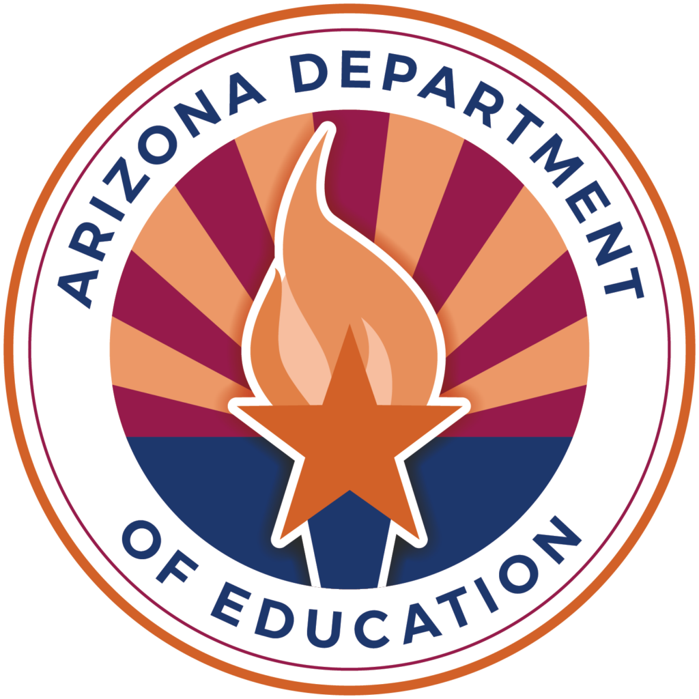

::: {.hero}
::: {.hero-copy}
## Arizona Data Science Corps

Professional learning, classroom-ready resources, and applied data science projects for Arizona educators.

[Explore 2026 pathways](#pathways){.btn .btn-primary}
[Daily schedule](schedule/schedule_2026_advanced.qmd){.btn .btn-secondary}
:::

::: {.hero-image}

:::
:::
Arizona Data Science Corps (AZDSC) addresses Arizona’s need for more teachers prepared to bring data science education into 6th–12th grade classrooms. Through statewide professional learning, AZDSC will support 180 teachers across all 15 Arizona counties, reaching approximately 18,000 students.

The project also supports the development of Arizona K–12 Data Science Education Standards and offers pathways for teachers, students, and researchers to engage in data science learning, career exploration, and education research.

## 2026 Workshop Hub {#pathways}

This site is the public home for schedules, pathway links, workshop notebooks, and examples of data science applications connected to NAU faculty work.

::: {.link-grid}
::: {.feature-card}
### Introductory Pathway

Foundational data science routines, classroom activities, and program information.

[Program document](https://docs.google.com/document/d/1HN1mC8yB2CI_n2YVYOlqeFdUBaTmdp3y2-VwJnV-wW0/edit?tab=t.0)  
:::

::: {.feature-card}
### Intermediate Pathway

For educators ready to extend data science activities into richer modeling and analysis.

[Program document](https://docs.google.com/document/d/1QupboSaD2lUKVYatw-xYTIohHXe1EhF9YQCnlwXZn54/edit?tab=t.0)  
:::

::: {.feature-card}
### Advanced Pathway

Project-based modeling experiences. Summer 2026 focuses on epidemic modeling and inference.

[Program document](https://docs.google.com/document/d/1Tc2rZrXk7NFPUL9y7A_Tj2mVQTKoOIcNlgDxT8RQ__g/edit?tab=t.0)  
[2026 workshop schedule](schedule/schedule_2026_advanced.qmd)
:::
:::

## Advanced Pathway Daily Schedule

The Summer 2026 advanced pathway focuses on epidemic modeling, parameter fitting, optimization, and MCMC. Participant notebooks and solution notebooks are linked directly from the daily schedule.

::: {.project-list}
::: {.project-card .active-project}
### Epidemic Modeling and Inference

Simulate SIR models, explore Markov chains, and use MCMC to infer parameters in epidemic models.

[Open daily schedule](schedule/schedule_2026_advanced.qmd)
:::
:::

## Faculty Data Science Applications

This space will showcase short, classroom-friendly data science applications from university faculty. Each example can include a short description, a dataset or notebook link, and suggestions for adapting the activity for middle or high school classrooms.

[View showcase template](faculty_applications.qmd)

## Support

This project is funded by NSF 2436761, which supports data science education and training to build a strong national data science infrastructure and workforce. Additionally, This project is co-funded by the Innovative Technology Experiences for Students and Teachers (ITEST) program, which supports projects that build understandings of practices, program elements, contexts and processes contributing to increasing students' knowledge and interest in science, technology, engineering, and mathematics (STEM) and information and communication technology (ICT) careers.

::: {.logo-row}
{fig-alt="National Science Foundation logo"}
{fig-alt="Northern Arizona University logo"}
{fig-alt="Arizona Department of Education seal"}
:::

